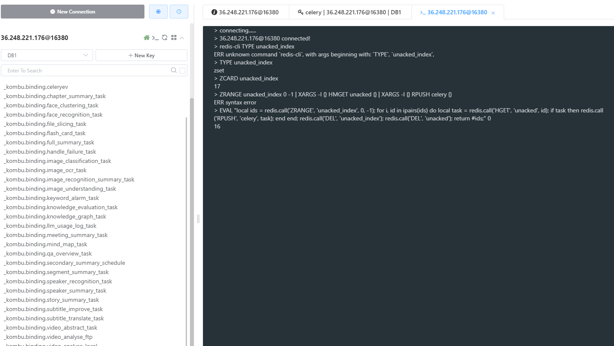

情况	推荐模式	理由
IO 密集型任务（比如你这种）	-P gevent	用协程实现高并发，节省资源
CPU 密集型任务	-P prefork	用多进程跑在不同 CPU 上，避免 GIL 限制
高可靠 / 任务隔离性要求高	-P prefork	子进程崩了不会影响主 worker，gevent 崩了是整个 worker

## 取出所有卡住的任务 → 恢复到正常队列 → 清空卡住状态
EVAL "local ids = redis.call('ZRANGE', 'unacked_index', 0, -1); for i, id in ipairs(ids) do local task = redis.call('HGET', 'unacked', id); if task then redis.call('RPUSH', 'celery', task); end end; redis.call('DEL', 'unacked_index'); redis.call('DEL', 'unacked'); return #ids;" 0
