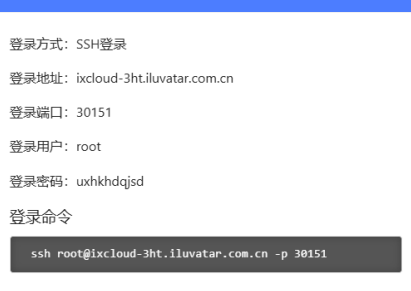

# 部署

## 研发环境

### 研发环境服务器信息

1. ip: 172.21.43.125
2. 密码：meiya@300188

### 研发环境更新

1. 本地提交代码
2. 执行命令：

   ```bash
      cd /root/data/nex_fusion && git pull && make build-api && cd /root/data/nex_fusion/docker/ && ./deploy.sh
   ```

> 注意：如果本地有改动先执行：git reset --hard HEAD

3. 选择配置文件1，再按需选择启动的服务

## 中检

### 中检服务器信息

1. ip: 36.248.214.27
2. 密码：WJYZJMY!2025wljg

### 中检更新

1. 本地提交代码
2. 执行命令：

   ```bash
        cd /data/tianq/nex_fusion && git pull && make build-api && cd /data/tianq/nex_fusion/docker/ && ./deploy.sh
   ```
3. 选择配置文件3，再按需选择启动的服务

##### 语音服务更新

1.部署路径 /data/wwtest/xujl/speakervoice/PolyVoice/docker-polyvoice/docker-compose.yaml

## 安胜

### 安胜服务器信息

#### 服务器1

1. 登录：`su -`
2. ip: 10.10.13.11
3. 密码：P9co188gtp@server998#

##### 安胜更新

1. 本地提交代码
2. 执行命令：

   ```bash
        cd /data/nex_fusion/nex_fusion && make pull-build-api && cd /data/nex_fusion/nex_fusion/docker && ./deploy.sh
   ```
3. 选择配置文件5，再按需选择启动的服务

#### 服务器2

1. 通过服务器1ssh
2. ip: 10.10.25.32
3. 密码：Video@as@2025@server

##### 语音服务更新

1. 本地提交代码
2. 执行命令：

   ```bash
        cd /data/polynex/model/PolyVoice/PolyVoice/backend && git pull && make build-asr && cd /data/polynex/model/PolyVoice/PolyVoice/docker-polyvoice && ./deploy.sh
   ```

## 互联网正式环境

### 互联网服务器信息

#### 服务器1

1. ip: 36.248.221.176
2. 密码：xujl1@418014!

##### 更新

1. 本地提交代码
2. 执行命令：

   ```bash
        cd /data/apps/nex_fusion && make pull-build-api && cd /data/apps/nex_fusion/docker && bash deploy.sh
   ```
3. 选择配置文件5，再按需选择启动的服务
cd /data/apps/NexOmni/backend && source .venv/bin/activate && cd /data/apps/NexOmni/backend/app && git pull && uvicorn main:app --host 0.0.0.0 --port 7200

## 远程桌面

### 信息

zhangwm
Szgtas!20250509
堡垒机：https://10.10.21.2
shendm
Meiya!@2025

甄视频平台地址：https://110.80.33.77:8660/galaxy
UKey MM：meiya@2025#
甄视频平台账号：BD0015/ww@2025@0401 、BD0013/lyx@2025@0401
远程桌面账号：zhangwm/Szgtas!20250509、huangxin/Szgt@2025!0528、baoming/Szgt@2025!0528
猎鹰6.0.6安装密钥： W2E9N-WU8HX-YOC9B-4K9DA-MQI7X

AI服务器：10.10.25.32   root/
Video@as@2025@server

root/mllm@2025#
pg_dump -U postgres -t model_configs nex_fusion  --data-only --inserts > model_configs.sql

10.10.13.11
P9co188gtp@server998#
10.10.25.32
Video@as@2025@server
36.248.221.206
WJYZJMY!2025wljg
81.68.195.143
xm-20250612-jintian
47.98.36.179
中简
master分支/data/tianq/PolyVoice/backend
speaker分支/data/wwtest/xujl/speakervoice/PolyVoice/



### 天数智芯：
登录方式：SSH登录
登录地址：ixcloud-3ht.iluvatar.com.cn
登录端口：31053
登录用户：root
登录密码：bdnwiefxki
登录命令
ssh root@ixcloud-3ht.iluvatar.com.cn -p 31053

829
909
905


1. 服务器IP：36.248.221.176:62222   （请本地备份好，此文档不再存留）
2. 账号：首次登录初始化密码：@dwsj$polynex@2025#
  1. wuwen
  2. shendm
  3. xujl / xujl1@418014!
  4. zhhh
  5. linqb
  6. root / #dwsj-polynex@2026@@
3. 操作规范
4. 不需要 Sudo 的情况：
  - 在 /data  /archive 目录下进行的新建文件、修改代码、删除日志等日常开发操作。
5. 需要使用Sudo的情况：
  1. apt install/update 安装系统级软件。
  2. systemctl restart 重启系统服务。
  3. 修改 /etc/nginx 等系统配置文件。


20260122：
多维视界
【百度云】36.248.221.176:62222 /@dwsj$polynex@2025#
【超算公网IP】218.107.217.195
【厦门超算】10.100.131.2 mybk/root        Szgt@2025
【安胜D网专线IP】218.207.101.82

【正式环境】dwsj.cn 、api.dwsj.cn 、media.dwsj.cn
【预发环境】pre.dwsj.cn、pre-api.dwsj.cn
Nexfusion 部署命令：
cd /data/apps/nex_fusion && make pull-build-api && cd /data/apps/nex_fusion/docker && bash deploy.sh
NexOmni部署命令：
cd /data/apps/NexOmni/backend && source .venv/bin/activate && cd /data/apps/NexOmni/backend/app && git pull && uvicorn main:app --host 0.0.0.0 --port 7200 
cd /data/apps/NexOmni/backend && make build-deploy

rebase 一下 pre-web
没冲突就到 pre-web 把 dev-web merge过来，push上去
到10.100.131.2 /data/apps/NexOmniWeb_Pre/web/

cd /data/apps/NexOmniWeb_Pre/web/apps/nex-omni-web
git pull
pnpm run build-only:prod-pre
pnpm run docker-build:prod-pre

第二个命令，运行后，会需要选择模式，输入1 回车就行

注意下命令不要敲错后缀，是 prod-pre